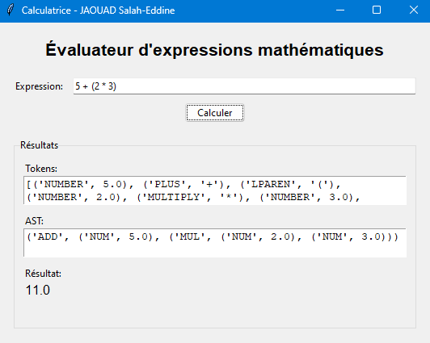

# Mini Compilateur d'Expressions Mathématiques
## Description
Cette application est un mini compilateur d'expressions mathématiques avec interface graphique, développé en Python. Il permet d'évaluer des expressions mathématiques en respectant la priorité des opérations et la gestion des parenthèses. Le programme décompose le processus de compilation en trois phases principales : analyse lexicale, analyse syntaxique et évaluation.

## Fonctionnalités
- Interface graphique intuitive
- Support des opérations mathématiques de base (+, -, *, /)
- Gestion des parenthèses (simples et imbriquées)
- Support des nombres décimaux
- Affichage détaillé du processus de compilation :
  - Tokens générés (analyse lexicale)
  - Arbre syntaxique abstrait (AST)
  - Résultat final

## Prérequis
- Python 3.x
- Tkinter (généralement inclus dans l'installation standard de Python)

## Installation
1. Clonez ou téléchargez le repository
2. Assurez-vous que Python est installé sur votre système
3. Aucune dépendance externe n'est requise car le projet utilise uniquement des bibliothèques standard Python

## Utilisation
1. Exécutez le script principal :
```bash
python mini_compilateur.py
```

2. Dans l'interface graphique :
   - Entrez une expression mathématique dans le champ de saisie
   - Cliquez sur le bouton "Calculer"
   - Observez les résultats dans les différentes zones d'affichage

## Exemples d'expressions valides
```
5 + 3
10 - (4 + 2)
2 * (3 + 4 * (5 - 2))
8.5 + 1.5
(7 + 3) * (6 - 2) / 2
```

## Structure du code
Le projet est organisé en plusieurs classes :

### MathLexer
- Responsable de l'analyse lexicale
- Convertit l'expression en une série de tokens
- Reconnaît les nombres, opérateurs et parenthèses

### MathParser
- Effectue l'analyse syntaxique
- Construit l'arbre syntaxique abstrait (AST)
- Gère la priorité des opérations

### MathEvaluator
- Évalue l'AST
- Calcule le résultat final
- Gère les erreurs de calcul (ex : division par zéro)

### MathCalculatorGUI
- Gère l'interface utilisateur
- Coordonne les différentes étapes du processus
- Affiche les résultats et les erreurs

## Gestion des erreurs
Le programme gère plusieurs types d'erreurs :
- Expressions mal formées
- Parenthèses non équilibrées
- Division par zéro
- Caractères invalides
- Expressions vides

## Limitations connues
- Ne gère pas les nombres négatifs en début d'expression
- Pas de support pour les fonctions mathématiques (sin, cos, etc.)
- Pas de support pour les opérateurs de puissance
- Interface non redimensionnable

## Contribution
Pour contribuer au projet :
1. Forkez le repository
2. Créez une nouvelle branche
3. Committez vos changements
4. Soumettez une pull request

## Améliorations possibles
- Ajouter le support des nombres négatifs
- Implémenter des fonctions mathématiques avancées
- Ajouter l'historique des calculs
- Améliorer l'interface utilisateur
- Ajouter des raccourcis clavier

## Capture d'écran


## Licence
Ce projet est sous licence MIT. Voir le fichier LICENSE pour plus de détails.

## Réalisé par
JAOUAD Salah-Eddine